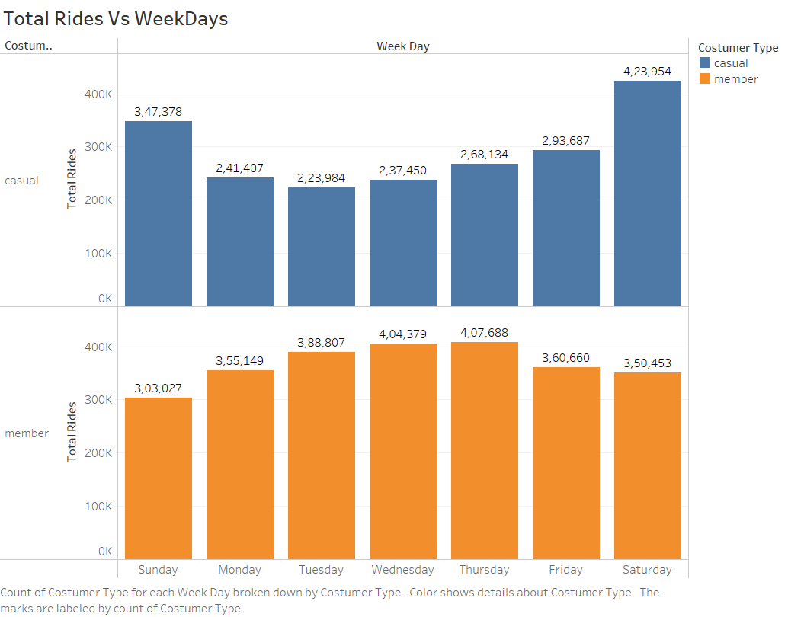
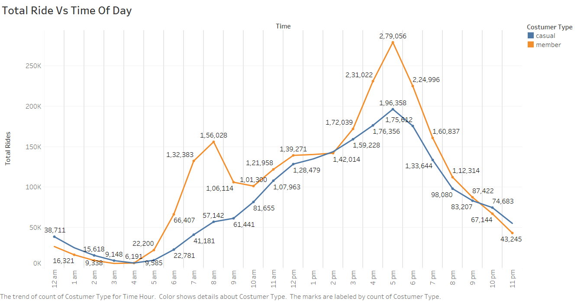
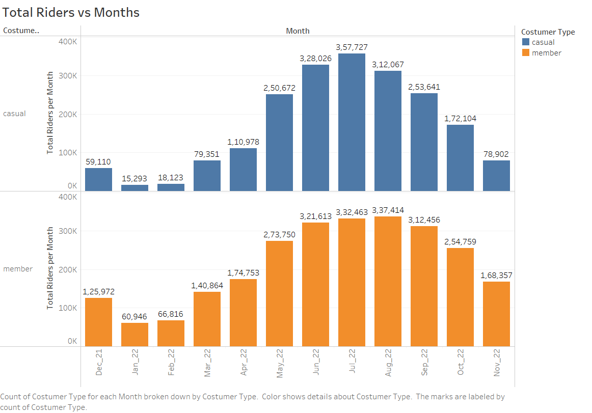
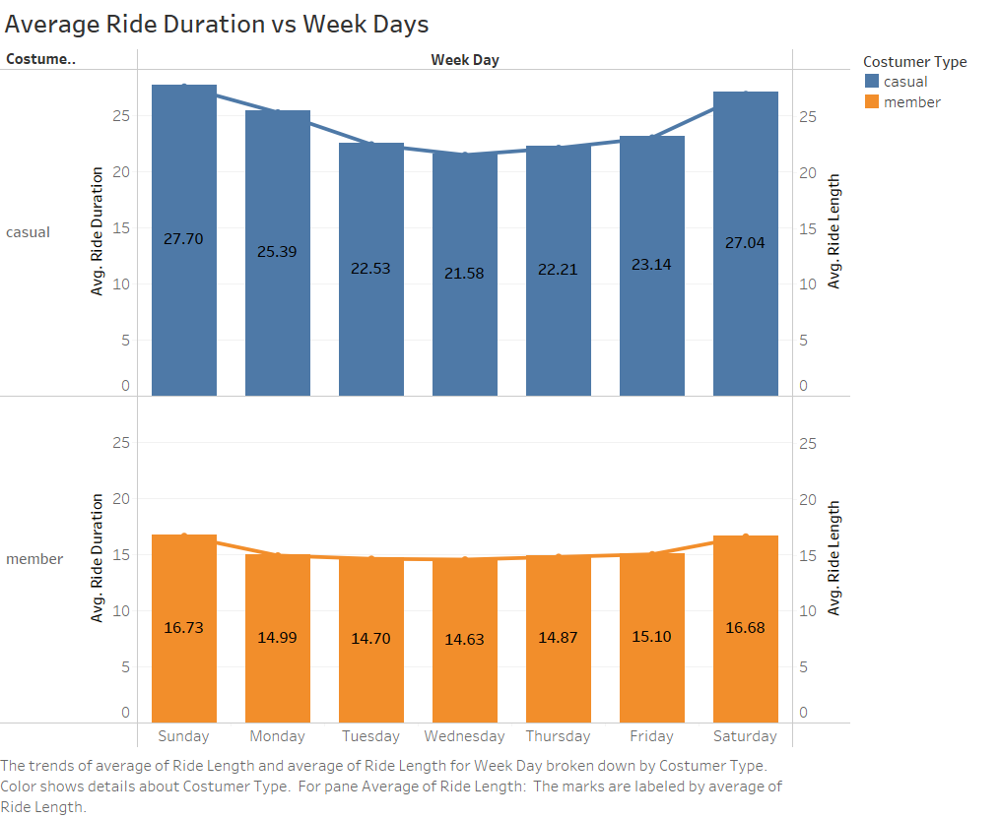
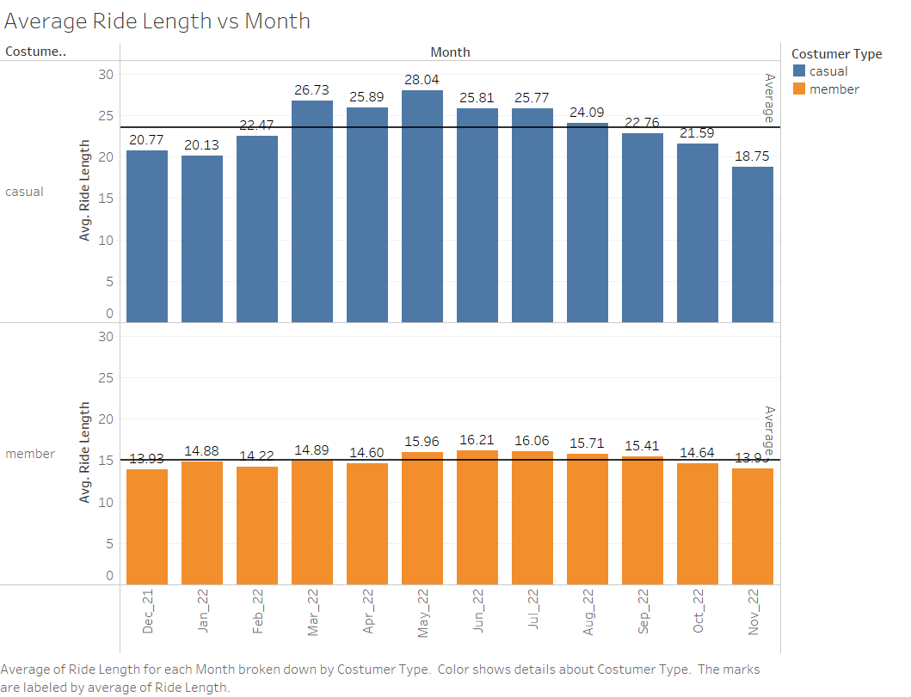
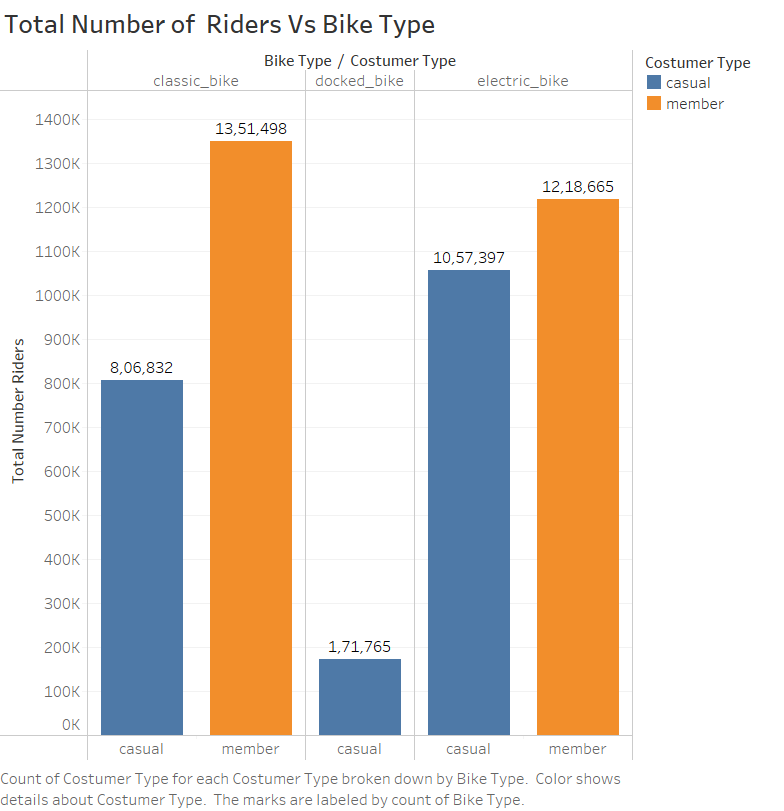

{width="350"}

## 1. **Introduction** {#sec-1.-introduction}

The bike share company, **Cyclistic**, is based in Chicago and offers services to its users. In order to **improve its marketing strategy** and drive future growth, the company is **interested in understanding the behavior of its users while using the services**. As a part of the Google Data Analytics certification course, I was given the opportunity to conduct a case study on Cyclistic to analyze the data and provide insights on the users' behavior. In this project, I will follow the steps of the data analysis process: **ask, prepare, process, analyze, and share**. **The aim of this case study is to provide actionable insights for the company to consider in their marketing strategy.**

<br>

## 2. **Scenario** {#sec-2.-scenario}

Cyclistic operates a fleet of more than 5,800 bicycles which can be accessed from over 600 docking stations across the city. Bikes can be borrowed from one docking station, ridden, then returned to any docking stations. Over the years marketing campaigns have been broad and targeted a cross-section of potential users. Data analysis has shown that riders with an annual membership are more profitable than casual riders. Lily Moreno, the director of marketing, wants to implement a new marketing strategy in order to convert casual riders into annual members. She believes that with the right campaign there is a very good chance of such conversions between the user types. There are also user-friendly bike options include such as electric bikes, classic bikes and docked bikes. It makes Cyclistic services more inclusive to people. Lily has tasked the marketing analytics team to analyze past user data of one year to find trends and habits of Cyclistic's users to help create this marketing campaign. The marketing analyst team would like to know:

-   **How annual members and casual riders differ**

-   **Why casual riders would buy a membership**

-   **How Cyclistic can use digital media to influence casual riders to become members.**

Here I have to analyze the Cyclistic historical bike trip data to identify trends in the usage of bikes by casual and member riders.

<br>

## 3. **Phase 1: Ask** {#sec-3.-phase-1-ask}

#### 3.0.1 **Business objective** {#sec-3.0.1-business-objective}

The business objective of the case study is to identify opportunities for targeted marketing campaigns to **convert casual riders into annual members**. This will be done through **analysis of bike trip data and understanding user behavior and preferences**. The ultimate goal is to **increase profitability** and drive future growth for the company.

#### 3.0.2 **Business task** {#sec-3.0.2-business-task}

As an analyst my take is to do following:-

-   Analyze Cyclistic's historical bike trip data
-   **Identify trends** and **patterns** in usage of bikes by **casual** and **member riders**
-   **Understand behavior** and preferences of these two user groups
-   Identify opportunities for targeted marketing campaigns to **convert casual riders into annual members**
-   Use **insights from analysis** to inform development of **new marketing strategy** for the company
-   **Goal:** increase profitability and drive future growth.

#### 3.0.3 **Stakeholders** {#sec-3.0.3-stakeholders}

The Stakeholders in this case study include:

-   **Lily Moreno**: **Director of Marketing** at Cyclistic, who is **responsible for implementing the marketing campaigns** at Cyclistic.

-   **Cyclistic's marketing team**: They will be responsible for conducting the analysis and **developing the marketing strategy** based on the insights gained.

-   **Cyclistic's casual riders**: They are the **target audience** of the marketing campaign, and their behavior and preferences will be a **key focus of the analysis**.

-   **Cyclistic's annual members**: They are the group that the marketing campaign is **trying to convert casual riders** into, and their behavior and preferences may be compared to those of casual riders in the analysis.

-   **Cyclistic's investors and shareholders**: They have a **financial interest** in the company's success and may be **interested in the results** of the analysis and any changes to the marketing strategy.

    <br>

## 4. **Phase 2: Prepare** {#sec-4.-phase-2-prepare}

#### 4.0.1 **Where is your data located?** {#sec-4.0.1-where-is-your-data-located}

The data for this analysis was obtained from **Motivate International Inc**. and can be **accessed through the provided [[link]{.underline}](https://divvy-tripdata.s3.amazonaws.com/index.html).** It includes **12 months of historical trip data from Cyclistic**, a fictional bike share company based in Chicago. It should be noted that the **data is public** and can be used to explore how different customer types are using Cyclistic bikes.

#### 4.0.2 **How is the Data Organized?** {#sec-4.0.2-how-is-the-data-organized}

For this project, the data used consists of **monthly CSV files** from the **past 12 months (December 2021 - November 2022)**. The **files include 13 columns of information** related to ride details, such as **ride id, ridership type, ride time, start and end locations, and geographic coordinates...etc.** The data is organized in a way that allows for **analysis of trends and patterns** in the usage of Cyclistic's bike share services.

#### 4.0.3 **Credibility of data** {#sec-4.0.3-credibility-of-data}

**Motivate, Inc.** collected the [[**data**]{.underline}](https://divvy-tripdata.s3.amazonaws.com/index.html) for this analysis directly through its **management of the Cyclistic Bike Share program for the City of Chicago**. The data is **comprehensive and consistent**, as it includes information on all rides taken by users and **is not just a sample**. It is also **current, as it is released on a monthly basis by the City of Chicago**. The data is made available to the **public by the City of Chicago**.

#### 4.0.4 **Licensing, privacy, security, and accessibility** {#sec-4.0.4-licensing-privacy-security-and-accessibility}

The [[**data**]{.underline}](https://divvy-tripdata.s3.amazonaws.com/index.html) used for this analysis has had all **identifying information removed** in order to **protect the privacy of users**. This limitation on the data does **restrict the scope of the possible analysis**, as it is not possible to determine whether casual riders are repeat users or residents of the Chicago area. The [[**data**]{.underline}](https://divvy-tripdata.s3.amazonaws.com/index.html) is **released under a** [[**specific license**]{.underline}](https://ride.divvybikes.com/data-license-agreement) and is made **available for use in this analysis**.

#### 4.0.5 **Ability of Data to answer Business Questions** {#sec-4.0.5-ability-of-data-to-answer-business-questions}

The **available dataset is sufficient** for the purpose of **answering the business question** regarding the differences in usage patterns between **annual members and casual riders**. Through detailed observation of the variables in the data, it has been determined that **casual riders typically pay for individual or daily rides**, while **member riders tend to purchase annual subscriptions**. This information is **important in understanding the behavioral differences** between the two groups and can be used to inform targeted marketing campaigns. Additional analysis of other variables in the data, such as **ride duration and location**, may provide further insights into the **usage patterns of annual members and casual riders.**

#### 4.0.6 **Challenges with the data** {#sec-4.0.6-challenges-with-the-data}

The **Challenges** I faced during my data analysis are:

-   **Data preparation** identified **several issues**, including **duplicate records** and **missing fields...etc**, which were addressed through **data cleaning**
-   **Large amount of data (1.2 GB)** required working with segments rather than attempting to use diskframe functions
-   Data cleaning, **removal of unnecessary variables**, and **saving to CSV file** on hard drive allowed for **efficient** processing and analysis of data
-   **Specialized tools or techniques**, were necessary for working with large amounts of data. Tools like **Excel failed to handle** this amount of data **R** and **Tableau** were used.

<br>

## 5. **Phase 3: Data Process** {#sec-5.-phase-3-data-process}

#### 5.0.1 **What tools are you choosing and why?** {#sec-5.0.1-what-tools-are-you-choosing-and-why}

-   In order to **efficiently prepare, process, clean, analyze, and visualize** the data for this project, I selected **RStudio Desktop** as the **primary tool**. The large size of the dataset made it **impractical** to use tools such as **Microsoft Excel or Google Sheets**, and **RStudio Cloud** was also **unable** **to handle** the volume of data. **RStudio Desktop provided the necessary capabilities to effectively work with the data and generate meaningful insights.**

-   In addition to RStudio Desktop, I also utilized **Tableau** to create **visualizations for this project**. The powerful data visualization capabilities of Tableau allowed me to **effectively communicate** the **results of the analysis and highlight key trends and patterns in the data**.

-   **Overall, the combination of RStudio Desktop and Tableau proved to be a powerful toolkit for preparing, processing, cleaning, analyzing, and visualizing the data for this project.**

#### 5.0.2 **Review of Data** {#sec-5.0.2-review-of-data}

In order to gain an **understanding of the data** and its **potential for analysis**, a review was conducted to **assess the content** of the variables, the **format of the data**, and the **integrity of the data**. This initial review provided an overview of the data and helped to identify any **potential issues or challenges that would need to be addressed** in the preparation and analysis process.

**Data review involved the following:**

-   **Checking column names across all the 12 original files.**
-   **Checking for missing values.**
-   **Checking of white spaces.**
-   **Checking of duplicate records.**
-   **Other data anomalies.**

**Results of the review found following things:**

-   **Duplicate record of ID numbers.**
-   **Records with missing start or end station name.**
-   **Records with very short or very long ride duration.**
-   **Records for trips starting or ending at an administrative station (repair or testing station).**

All 12 files were combined into one data set after initial review was completed.The final data set consisted of **5733451 rows** with **13 columns** of character and numeric data. **This matched the number of records in all 12 monthly data files**.

#### 5.0.3 **Setting up environment** {#sec-5.0.3-setting-up-environment}

```{r eval=FALSE}
#----------------------------------------------------------------------------------#
#load packages
library(tidyverse)
library(lubridate)
library(janitor)
library(data.table)
library(readr)
library(psych)
library(hrbrthemes)
library(ggplot2)

#----------------------------------------------------------------------------------#
```

#### 5.0.4 **Data Validation** {#sec-5.0.4-data-validation}

-   To enable more efficient and comprehensive analysis, it was necessary to **upload the individual data files into new vectors and combine them into a single, large dataset**. This process involved merging the data frames into a cohesive whole, allowing for more effective analysis and interpretation of the data.

```{r eval=FALSE}
#----------------------------------------------------------------------------------#
#Import Data
december_2021 <- read.csv("data/202112-divvy-tripdata.csv")
january_2022 <- read.csv("data/202201-divvy-tripdata.csv")
february_2022 <- read.csv("data/202202-divvy-tripdata.csv")
march_2022 <- read.csv("data/202203-divvy-tripdata.csv")
april_2022 <- read.csv("data/202204-divvy-tripdata.csv")
may_2022 <- read.csv("data/202205-divvy-tripdata.csv")
june_2022 <- read.csv("data/202206-divvy-tripdata.csv")
july_2022 <- read.csv("data/202207-divvy-tripdata.csv")
august_2022 <- read.csv("data/202208-divvy-tripdata.csv")
september_2022 <- read.csv("data/202209-divvy-publictripdata.csv")
october_2022 <- read.csv("data/202210-divvy-tripdata.csv")
november_2022 <- read.csv("data/202211-divvy-tripdata.csv")
#----------------------------------------------------------------------------------#
```

-   To ensure the **accuracy and integrity** of the combined dataset, it was necessary to verify that the **column names in the individual data files were compatible for merging**. This involved comparing the **names** and ensuring that they **matched perfectly, regardless of their order**. This step was crucial to enable the use of a command to join the data into a single file.

```{r eval=FALSE}
#----------------------------------------------------------------------------------#
#Data Validation
colnames(december_2021)
colnames(january_2022)
colnames(february_2022)
colnames(march_2022)
colnames(april_2022)
colnames(may_2022)
colnames(june_2022)
colnames(july_2022)
colnames(august_2022)
colnames(september_2022)
colnames(october_2022)
colnames(november_2022)
#----------------------------------------------------------------------------------#
```

-   The **total number of records** in all 12 monthly data files was calculated to be **5733451 rows** and **13 columns**. This information provides an overview of the **size and scope of the data**, which can be helpful in planning and executing the analysis process.

```{r eval=FALSE}
#----------------------------------------------------------------------------------#
# Total number of rows
sum(nrow(december_2021) + nrow(january_2022) + nrow(february_2022) 
    + nrow(march_2022) + nrow(april_2022) + nrow(may_2022) 
    + nrow(june_2022) + nrow(july_2022) + nrow(august_2022)
    + nrow(september_2022) + nrow(october_2022) + nrow(november_2022))
#----------------------------------------------------------------------------------#
```

-   In the next step, the monthly data frames were **aggregated** into a **single data frame**. This involved **combining the data from each of the monthly files** into a cohesive whole, allowing for more efficient and comprehensive analysis of the data. **Aggregating the data in this way also made it easier to identify trends and patterns across the entire dataset**, rather than having to analyze the data for each month separately.

```{r eval=FALSE}
#----------------------------------------------------------------------------------#
# Combine Data of 12 month into one for smooth workflow
trip_final <- rbind(december_2021,january_2022,february_2022,march_2022,april_2022,
                    may_2022,june_2022,july_2022,august_2022,september_2022,october_2022,november_2022)
#----------------------------------------------------------------------------------#
```

-   After aggregating the monthly data frames into a single data frame, the **resulting combined dataset** was **written to a new file** and **saved to the hard drive**. This allows for **easier access** to the data for further analysis and visualization, and ensures that the data is **available for future reference**. Saving the data to a file on the hard drive also ensures that it is **backed up** and **protected against accidental loss or damage**.

```{r eval=FALSE}
#----------------------------------------------------------------------------------#
# Save the combined files
write.csv(trip_final,file = "data/trip_final.csv",row.names = FALSE)
#----------------------------------------------------------------------------------#
```

-   After being saved to the hard drive, the data was once again **subjected to validation** in order to **ensure its accuracy, completeness, and consistency**. This process involved reviewing the data for **errors or inconsistencies, checking for missing or incomplete records**, and verifying that the data met the requirements and expectations of the analysis.

```{r eval=FALSE}
#----------------------------------------------------------------------------------#
#Final data validation
str(trip_final)
View(head(trip_final))
View(tail(trip_final))
dim(trip_final)
summary(trip_final)
names(trip_final)
#----------------------------------------------------------------------------------#
```

<br>

## 6. **Phase 4: Data Cleaning** {#sec-6.-phase-4-data-cleaning}

In this stage, I performed data cleaning to **identify and correct or remove errors or inconsistencies from the data**. This will involve a variety of techniques, such as correcting errors in data entry, **removing duplicates** or **incorrect records**, and **standardizing data** **formats** to ensure compatibility with analysis tools. Data cleaning is an important step in the data analysis process, as it helps to ensure that the **data is accurate and reliable**, and that the results of the analysis are **meaningful and useful**.

-   Before beginning the data cleaning process, it is necessary to check the **total number of rows with missing or "NA" values**. Understanding the extent of missing or incomplete data helps to inform decisions about how to handle these values, such as whether to **drop them from the dataset or impute them with estimates or substitute values.**

```{r eval=FALSE}
#----------------------------------------------------------------------------------#
#Count rows with "na" values
colSums(is.na(trip_final))
#----------------------------------------------------------------------------------#
```

-   To ensure the integrity and reliability of the data, it is necessary to remove a certain percentage of missing or "NA" values. In this case, **the missing values will be removed and saved into a new data frame**.

```{r eval=FALSE}
#----------------------------------------------------------------------------------#
#Remove missing
clean_trip_final <- trip_final[complete.cases(trip_final), ]
#----------------------------------------------------------------------------------#
```

-   **Removing duplicates** helps to ensure that the data is as **complete and accurate** as possible, and that the results of the analysis are **not unduly influenced by duplicate or erroneous data.**

```{r eval=FALSE}
#----------------------------------------------------------------------------------#
#Remove duplicates
clean_trip_final <- distinct(clean_trip_final)
#----------------------------------------------------------------------------------#
```

-   To further refine and clean the data, it is necessary to **remove empty, "NA", and missing values**. This can be achieved through the use of functions such as **drop_na()**, **remove_empty()**, and **remove_missing()**

```{r eval=FALSE}
#----------------------------------------------------------------------------------#
#Remove na
clean_trip_final <- drop_na(clean_trip_final)
clean_trip_final <- remove_empty(clean_trip_final)
clean_trip_final <- remove_missing(clean_trip_final)
#----------------------------------------------------------------------------------#
```

-   Now, it is necessary to filter out records where the value of the **"started_at"** variable is **greater than** the value of the **"ended_at"** variable. This can help to ensure that the data is **accurate and meaningful**

```{r eval=FALSE}
#----------------------------------------------------------------------------------#
#Remove data with greater start_at than end_at
clean_trip_final<- clean_trip_final %>% 
  filter(started_at < ended_at)
#----------------------------------------------------------------------------------#
```

-   To **improve the clarity and understanding** of the data, it is necessary to change a **few column names**. This involve's renaming columns to more **accurately reflect their content**, or to use more **descriptive or intuitive names.**

```{r eval=FALSE}
#----------------------------------------------------------------------------------#
#Renaming column for better context
clean_trip_final <- rename(clean_trip_final, costumer_type = member_casual, bike_type = rideable_type)
#----------------------------------------------------------------------------------#
```

-   To facilitate more **granular analysis** of the data, additional columns were **created** for the **date**, **month, day, year, and day of the week** based on the **"started_at"** column. This allowed for more **detailed analysis of the data by specific dates, days, or months,** and helped to identify trends and patterns that may not have been apparent when analyzing the data at a more general level.

```{r eval=FALSE}
#----------------------------------------------------------------------------------#
#Separate date in date, day, month, year for better analysis
clean_trip_final$date <- as.Date(clean_trip_final$started_at)
clean_trip_final$week_day <- format(as.Date(clean_trip_final$date), "%A")
clean_trip_final$month <- format(as.Date(clean_trip_final$date), "%b_%y")
clean_trip_final$year <- format(clean_trip_final$date, "%Y")
#----------------------------------------------------------------------------------#
```

-   **Similarly a new column was created just for the time** **in "%H:%M" format.**

```{r eval=FALSE}
#----------------------------------------------------------------------------------#
#Separate column for time
clean_trip_final$time <- as.POSIXct(clean_trip_final$started_at, format = "%Y-%m-%d %H:%M:%S")
clean_trip_final$time <- format(clean_trip_final$time, format = "%H:%M")
#----------------------------------------------------------------------------------#
```

-   To gain a better understanding of the **duration of rides**, a **column was created** to calculate the duration of rides based on the **start and end time of each ride**. This allows for more detailed analysis of **ride duration's**, and can help to **identify trends and patterns** in the data.

```{r eval=FALSE}
#----------------------------------------------------------------------------------#
#Add ride length column
clean_trip_final$ride_length <- difftime(clean_trip_final$ended_at, clean_trip_final$started_at, units = "mins")
#----------------------------------------------------------------------------------#
```

-   To focus the analysis on the **variables of interest**, data that will not be used for this analysis was **filtered out**. This was done using the **"select()"** function to **select only the relevant variables.**

```{r eval=FALSE}
#----------------------------------------------------------------------------------#
#Select the data we are going to use
clean_trip_final <- clean_trip_final %>% 
  select(bike_type, costumer_type, month, year, time, started_at, week_day, ride_length)
#----------------------------------------------------------------------------------#
```

-   To ensure the accuracy and reliability of the data, it is necessary to **get rid of excessively long rides**, as these may be **considered stolen** by Cyclistic. Rides are typically **limited to a duration of one day or 1440 minutes, or 24 hours** also **data below 5 minutes** was removed due to it begin too small for affecting this analysis.

```{r eval=FALSE}
#----------------------------------------------------------------------------------#
#Remove stolen bikes
clean_trip_final <- clean_trip_final[!clean_trip_final$ride_length>1440,] 
clean_trip_final <- clean_trip_final[!clean_trip_final$ride_length<5,] 
#----------------------------------------------------------------------------------#
```

-   Before moving on to the **next phase** of the data analysis process, it is important to perform **one final check** to ensure that all necessary data cleaning and preparation steps have been completed.

```{r eval=FALSE}
#----------------------------------------------------------------------------------#
#Check Cleaned data
colSums(is.na(clean_trip_final))
View(filter(clean_trip_final, clean_trip_final$started_at > clean_trip_final$ended_at))
View(filter(clean_trip_final, clean_trip_final$ride_length>1440 | clean_trip_final < 5))
#----------------------------------------------------------------------------------#
```

-   Once all necessary data cleaning and preparation steps have been completed, **the data can be saved to the hard disk as a csv file**.

```{r eval=FALSE}
#----------------------------------------------------------------------------------#
#Save the cleaned data
write.csv(clean_trip_final,file = "clean_trip_final.csv",row.names = FALSE)
#----------------------------------------------------------------------------------#
```

<br>

## 7. **Phase 5: Data analysis** {#sec-7.-phase-5-data-analysis}

During the **Data analysis phase**, I **explored the data** in order to gain a **better understanding** of its **characteristics and patterns**. I **created charts, graphs, and other types of visualizations** to help visualize the data and identify trends. I also used **statistical techniques**, such as regression analysis, to identify relationships between different variables in the data. By analyzing the data in this way, I was able to **extract insights and knowledge** that could inform **business decisions and support decision making.**

-   To begin the analysis phase, I **imported the cleaned** and prepared trip data into my analysis software. I conducted a thorough **validation of the data** to ensure that it was **accurate and free of errors.**

```{r eval=FALSE}
#----------------------------------------------------------------------------------#
#import the cleaned data
clean_trip_final <- read_csv("clean_trip_final.csv")

str(clean_trip_final)
names(clean_trip_final)
#----------------------------------------------------------------------------------#
```

-   To better facilitate my analysis, I **sorted the month and week day** variables in the trip data in ascending order. This allowed me to **easily compare and analyze trends across different time periods and days of the week.**

```{r eval=FALSE}
#----------------------------------------------------------------------------------#
#order the data
clean_trip_final$month <- ordered(clean_trip_final$month,levels=c("Dec_21","Jan_22","Feb_22","Mar_22", 
                                                                   "Apr_22","May_22","Jun_22","Jul_22", 
                                                                   "Aug_22","Sep_22","Oct_22","Nov_22"))

clean_trip_final$week_day <- ordered(clean_trip_final$week_day, levels = c("Sunday", "Monday", "Tuesday", 
                                                                           "Wednesday", "Thursday", 
                                                                           "Friday", "Saturday"))
#----------------------------------------------------------------------------------#
```

-   As a **first step** in my analysis, I calculated key **summary statistics** for ride length, including the **minimum, maximum, median, and average values**. These values provided a broad overview of the distribution of ride lengths among Cyclistic's customers and allowed me to identify any **extreme values or unusual patterns** in the data.

```{r eval=FALSE}
#----------------------------------------------------------------------------------#
#Analysis:- min, max, median, average
View(describe(clean_trip_final$ride_length, fast=TRUE))
#----------------------------------------------------------------------------------#
```

-   As a next step in my analysis, I examined the **distribution of Cyclistic's customers by membership** type. This included breaking down the data by **annual members** and **casual riders**.

```{r eval=FALSE}
#----------------------------------------------------------------------------------#
#Total no. of customers
View(table(clean_trip_final$costumer_type))
#----------------------------------------------------------------------------------#
```

-   Continuing my analysis, I calculated the **total number of rides taken by each customer type**, as well as the total duration of these rides in minutes. This analysis allowed me to **understand the overall usage patterns** of Cyclistic's bike share service among different customer types

```{r eval=FALSE}
#----------------------------------------------------------------------------------#
#Total rides for each customer type in minutes
View(setNames(aggregate(ride_length ~ costumer_type, clean_trip_final, sum), c("customer_type", "total_ride_len(mins)")))
#----------------------------------------------------------------------------------#
```

-   In my next analysis, I focused specifically on **comparing the ride length patterns of annual members and casual riders**. To do this, I calculated key summary statistics, including the **mean,** **median, maximum, and minimum values**, for ride length among these two customer types.

```{r eval=FALSE}
#----------------------------------------------------------------------------------#
#Differences between members and casual riders in terms of length of ride
View(clean_trip_final %>% 
       group_by(costumer_type) %>% 
       summarise(min_length_mins = min(ride_length), max_length_min = max(ride_length),
                 median_length_mins = median(ride_length), mean_length_min = mean(ride_length)))
#----------------------------------------------------------------------------------#
```

-   In my subsequent analysis, I focused on analyzing the **average ride length of Cyclistic's users by day of the week**, as well as the **total number of rides** taken on each day of the week.

```{r eval=FALSE}
#----------------------------------------------------------------------------------#
#Average ride_length for users by day_of_week and Number of total rides by day_of_week
View(clean_trip_final %>% 
       group_by(week_day) %>% 
       summarise(Avg_length = mean(ride_length),
                 number_of_ride = n()))
#----------------------------------------------------------------------------------#
```

-   After this, I analyzed the **number of average rides taken by Cyclistic's users by month**. This analysis allowed me to understand the **seasonal fluctuations** in usage of the bike share service, and to identify any **trends or patterns** in usage levels over the **course of a year**.

```{r eval=FALSE}
#----------------------------------------------------------------------------------#
#Average ride_length by month
View(clean_trip_final %>% 
       group_by(month) %>% 
       summarise(Avg_length = mean(ride_length),
                 number_of_ride = n()))
#----------------------------------------------------------------------------------#
```

-   Now, I compared the **average ride length of Cyclistic's users by week day according to customer type**. This analysis allowed me to understand how the **behavior and usage patterns** of annual members and casual riders **differed** from one another on **different days of the week**.

```{r eval=FALSE}
#----------------------------------------------------------------------------------#
#Average ride length comparison by each week day according to each customer type
View(aggregate(clean_trip_final$ride_length ~ clean_trip_final$costumer_type + 
                 clean_trip_final$week_day, FUN = mean))
#----------------------------------------------------------------------------------#
```

-   In my next analysis, I compared the **average ride length of Cyclistic's users by month according to customer type**.

```{r eval=FALSE}
#----------------------------------------------------------------------------------#
#Average ride length comparison by each month according to each customer type
View(aggregate(clean_trip_final$ride_length ~ clean_trip_final$costumer_type + 
                 clean_trip_final$month, FUN = mean))
#----------------------------------------------------------------------------------#
```

-   Here, I analyzed the **ride length data of Cyclistic's users by customer type and weekday**. This allowed me to understand the behavior and usage patterns of annual members and casual riders on different days of the week.

```{r eval=FALSE}
#----------------------------------------------------------------------------------#
#Analyze rider length data by customer type and weekday
View(clean_trip_final %>% 
       group_by(costumer_type, week_day) %>% 
       summarise(number_of_ride = n(),
                 avgerage_duration = mean(ride_length),
                 median_duration = median(ride_length),
                 max_duration = max(ride_length),
                 min_duration = min(ride_length)))
#----------------------------------------------------------------------------------#
```

-   Here, I analyzed the **ride length data of Cyclistic's users by customer type and month**.

```{r eval=FALSE}
#----------------------------------------------------------------------------------#
#Analyze rider length data by customer type and month
View(clean_trip_final %>% 
       group_by(costumer_type, month) %>% 
       summarise(nummber_of_ride = n(),
                 average_duration = mean(ride_length),
                 median_duration = median(ride_length),
                 max_duration = max(ride_length),
                 min_duration = min(ride_length)))
#----------------------------------------------------------------------------------#
```

-   The data was then written to a new file **next phase of data visualization**.

```{r eval=FALSE}
#----------------------------------------------------------------------------------#
#Save the data for data visualization
write.csv(clean_trip_final,file = "clean_trip_final_tableau.csv",row.names = FALSE)
#----------------------------------------------------------------------------------#
```

<br>

## 8. **Phase 6: Data Visualizations and Summary** {#sec-8.-phase-6-data-visualizations-and-summary}

#### 8.0.1 **Visualization 1** {#sec-8.0.1-visualization-1--}

-   This visualization shows the **total number of rides per day of the week for each customer type**. It appears that **casual riders** have the **highest number of rides on Saturdays and Sundays**, potentially indicating **leisurely use of the bikes on the weekends**. Meanwhile, **members** have a more **consistent number of rides throughout the week**, with slightly higher numbers on **Tuesdays and Wednesdays**. This suggests that members may primarily use the bikes for their **regular commuting needs**.

{width="651"}

#### 8.0.2 **Visualization 2** {#sec-8.0.2-visualization-2--}

-   This plot demonstrates that **annual members tend to use the bikes more frequently during rush hour**, potentially for **commuting to and from work**. On the other hand, **casual riders show a more steady increase in usage throughout the day, with a peak at around 6pm and a steady decrease thereafter**. This suggests that casual riders may be using the bikes more **for leisure activities**. These insights provide valuable information on the **different usage patterns of annual members and casual riders**, which can inform strategies for promoting the bike share program and targeting different customer segments.



#### 8.0.3 **Visualization 3** {#sec-8.0.3-visualization-3--}

-   This plot shows the **monthly usage trends of bike sharing among annual members and casual riders**. It appears that there is a **higher demand for bike usage during the summer months for both customer types**, with casual riders showing a slightly higher demand. On the other hand, the demand for bike usage among **casual riders decreases significantly in the winter months**, while **annual members continue to use the service at a relatively consistent rate throughout the year**. **This further supports our analysis that annual members may rely on the bike sharing service for their regular commute, while casual riders may use it more for leisure and recreational purposes.**

{width="716"}

#### 8.0.4 **Visualization 4** {#sec-8.0.4-visualization-4--}

-   In this plot between the **Avg. Ride duration and Week days**, It is clear that **casual riders tend to use the bike share service primarily on weekends** for leisure or recreational purposes, while **annual members use the service more consistently throughout the week**, possibly for commuting to work or other daily activities. This information could be useful for Cyclistic in terms of understanding how to target marketing efforts and **potentially adjusting pricing or membership plans to better meet the needs of these different customer groups**.

{width="672"}

#### 8.0.5 **Visualization 5** {#sec-8.0.5-visualization-5--}

-   To summarize, the analysis of the plot showed that annual members and casual riders use the bike-sharing service differently. **Annual members tend to use the bikes for their regular commutes, with a steadier usage throughout the week and year**. **Casual riders, on the other hand, tend to use the bikes more for leisure, with higher usage on weekends and in the summer months**. Additionally, **the average ride length for casual riders was found to be longer than that of annual members.** These findings can inform business decisions and support decision making for the bike-sharing company.

{width="719"}

#### 8.0.6 **Visualization 6** {#sec-8.0.6-visualization-6--}

-   The analysis of bike type usage showed that **members prefer classic bikes over electric** **and docked bikes,** while **casual riders have similar usage of electric bikes and a slightly higher preference for docked bikes.** It was unclear from the data sets what exactly is meant by "docked bikes," but it is evident that this type of bike is not a popular choice for annual members as **no member used it over the year**. **Overall, both groups showed a preference for classic bikes over the other options.**

{width="537"}

#### 8.0.7 **Visualization 7** {#sec-8.0.7-visualization-7--}

-   Additionally, this graph indicates that **classic bikes are the most popular choice among both members and casual riders, followed by electric bikes. Docked bikes are the least popular choice.** It is worth noting that the popularity of **classic bikes among annual members is much higher compared to casual riders**. **This could suggest that annual members have a preference for classic bikes over the other options, possibly due to their reliability and simplicity**. On the other hand, **casual riders seem to have a more balanced distribution** of bike choices, with electric bikes being a close second in popularity. Overall, **this graph provides insights into the preferences and habits of bike-sharing service users**, which could be useful for the company in terms of marketing and resource allocation.

{width="837"}

<br>

## 9. **Phase 7: Act** {#sec-9.-phase-7-act}

#### 9.0.1 **Key Takeaways :** {#sec-9.0.1-key-takeaways}

-   Annual members primarily use the bike-sharing service for commuting purposes, while casual riders tend to use it for leisure, particularly on weekends and in the summer months.
-   Annual members exhibit a more consistent usage of the service throughout the week and year, compared to casual riders.
-   Both annual members and casual riders favor classic bikes over the other two types of bikes offered. However, annual members primarily use classic bikes and rarely use docked bikes, while casual riders are more likely to use all types of bikes.
-   Casual riders tend to have longer ride duration's, averaging around 50% longer than annual members.
-   Casual riders show lower usage of the service during the winter months compared to annual members.

#### 9.0.2 **Recommendations :** {#sec-9.0.2-recommendations-}

-   Increase marketing efforts targeting leisure riders, especially during the summer months and on weekends, in order to increase bike usage and revenue.
-   Consider offering discounts or incentives for annual members to encourage them to use the bikes more regularly throughout the week and year.
-   Evaluate the reasons for the low popularity of docked bikes among both annual members and casual riders, and consider reevaluating the offering or improving the service to increase usage.
-   Focus on improving the classic bike fleet, as it is the most popular among both annual members and casual riders.
-   Consider offering longer rental periods or multi-day rentals for casual riders, as their average ride length is longer than annual members, in order to increase revenue.
-   Increase marketing efforts targeting casual riders during the winter months in order to increase usage and revenue during traditionally slower periods.

#### \-\-\-\-\-\-\-\-\-\-\-\-\-\-\-\-\-\-\-\-\-\-\-\-\-\-\-\-\-\-\-\-\-\-\-\-\-\-\-\-\-\-\--End of Case Study------------------------------------------------
